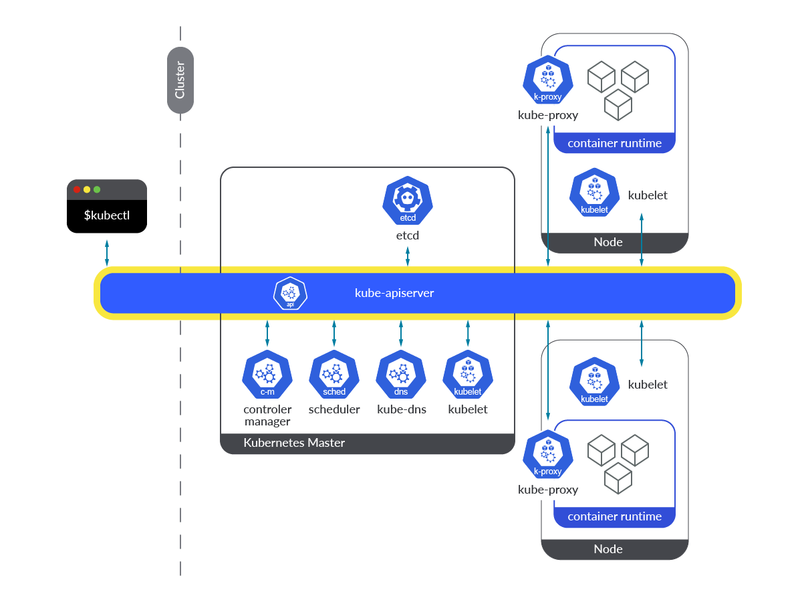

# Deploying web applications into Kubernetes

During this lab, we will build a simple web app in Go and learn how to deploy it into Kubernetes. Each section is closed with an exercise and a test, pass each to complete the lab.

## Table of Contents

1. [A basic web service](#a-basic-web-service)
1. [Deploy into Kubernetes](#deploy-into-kubernetes)

## A basic web service

One of the greatest strengths of Go lies in the its suitability for developing web applications. It offers a HTTP server as part of the standard library, it guarantees great performance, and the compiled binary is easy to deploy as a container into Kubernetes. This exercise will walk you through building a basic "hello-world" web application with Go.

### Initialize a Go module

First we create a new Go module. This is not strictly necessary for building and running Go programs locally, but unavoidable if we want to later package them up into a container. 

First, go to the root of this repo and initialize a new Go project under `99-labs/code/helloworld`. We will work in this directory throughout this lab. The directory contains some code (mostly tests) we prepared for you to simplify your work so do not remove anything you find there.

``` sh
cd 99-labs/code/helloworld
go mod init helloworld                            # init Go module
go get github.com/stretchr/testify/assert         # add depencency
go mod tidy                                       # update module version
```

The above assumes that you will never publish your code and make it available through `pkg.go.dev` for others to `go get` it.  If you ever want to publish code, make sure to choose a globally unique package name. The best option is to init a new project at GitHub.com, say, under `github.com/<my-user>/<my-package>`, where `<my-user>` is your GitHub id and `<my-package>` is the package name, init the go module with this full name, and publish from GitHub. Since we will not upload the code to GitHub (in fact, we *ask you* not to upload it), the package name can be anything. 

> [!WARNING]   
> Please do not publish your solutions because you spoil the fun for everyone else (plus, we regularly change the exercises so your published code would not work for other people anyway). 

### A Go web server

The below simple Go program will open an HTTP server at port 8080, listen to HTTP queries on the path `/`, and respond with the usual greeting `Hello, world!`. 

``` go
package main

import (
	"fmt"
	"net/http"
)

func HelloHandler(w http.ResponseWriter, r *http.Request) {
	fmt.Fprint(w, "Hello, world!\n")
}

func main() {
	http.HandleFunc("/", HelloHandler)
	http.ListenAndServe(":8080", nil)
}
```

The first line, `package main` declares that the code belongs to the `main` package. In the next few lines, the `net/http` and `fmt` packages are imported: the former provides the HTTP server implementation and the latter helps formatting strings. The `HelloHandler` function is a standard HTTP request handler with the signature `func(w http.ResponseWriter, r *http.Request)`, where `r` can be used to access the details of the HTTP request being served and `w` is used to write the response. We use `fmt.Fprint` to write the string `Hello, world!` into the HTTP response. When not specifying otherwise, Go will automatically set the HTTP status 200 OK in the response.

The `main` function first assigns the `HelloHandler` request handler to the HTTP path `/`, meaning that whenever the server is called with an empty path (say, using the URL `http://example.com/`) it will call our handler that will respond with the `Hello, world!` greeting. Finally, `http.ListenAndServe` spawns the HTTP server on port 8080. This function is blocking, so the program won't exit unless it encounters en error (or it is explicitly killed)

### Test

Copy the code into a new file named `main.go` and execute it with `go run main.go` (you can also use `go build` that will build the `main` package into an executable). If all goes well, the prompt should disappear: the HTTP server silently starts and awaits requests. Send one from another terminal using the omnipotent `curl` tool:

``` sh
curl http://localhost:8080/
Hello, world!
```

> [!NOTE]   
> The address `localhost` is the short name for the loopback interface address, which defaults to `127.0.0.1`. Also note that the trailing slash is optional, so the following request would be equivalent: `curl http://127.0.0.1:8080`

Congratulations, you have built and run your first Go web app! Now fire up your favorite browser and direct it to the URL `localhost:8080` and see your first webpage rendered in full glory.

### Exercise

Modify the program to return the hostname of the server it is running at. This requires the following changes to `main.go`:
- first, import the `os` package from the Go standard lib: add `os` to the `import` list in parentheses;
- declare a global variable called `hostname` of type string that we will use to store the hostname: `var hostname string`;
- before starting the web server in the `main` function, store the hostname in the global variable;
- first query the hostname: `h, err := os.Hostname()`, where `h` is a temporary variable for the return value and `err` will contain the error if something goes wrong;
- make sure to check the error before proceeding: 
  ```go
  if err != nil {
      panic(err)
  }
  ```
- store the returned hostname in the global variable `hostname` so that the HTTP handler, which runs in a separate function and so cannot reach `h`, will access it: `hostname = h`
- finally, modify the HTTP handler `HelloHandler` to add value of the global `hostname` variable to the response: `fmt.Fprintf(w, "Hello world from %s!\n", hostname)`

> ✅ **Check**
>
> Run the below test to check whether you have successfully completed the task. If all goes well, you should see the output `PASS`.
> ``` sh
> go test ./... --tags=helloworldhostname -v -count 1
> PASS
> ```
> Make sure the web service is running locally (i.e., execute `go run main.go` before running the test): the test issues requests to the HTTP server and checks whether the response is as expected.

We have also created an experimental test that starts the web service before executing the tests and stops it afterwards. At this point this test merely serves for us to understand how we can write totally self-contained tests; please execute it and tell us whether it worked out fine.

> ✅ **Check (experimental)**
>
> Run the below test to make sure that you have successfully completed the first exercise. If all goes well, you should see the output `PASS`.
> ``` sh
> go test --tags=main -run TestHelloWorldLocal -count 1
> PASS
> ```

## Deploy into Kubernetes

Kubernetes is undoubtedly the present and the near future of managing containerized microservice applications.

A Kubernetes *cluster* consists of a set of worker machines (*nodes*) that run containerized applications, plus a *control plane* that manages the worker nodes and the containers running on them. The control plane components make global decisions about the cluster and maintain cluster state. In production setting some nodes are dedicated to run the control plane separately from the worker nodes that execute the *workload* (the containers, called *pods* in Kubernetes), but control plane components can be run on any node and can share the same node as the workers. This allows to run Kubernetes on a single node (like in Minikube).



The most important component of the control plane is the `kube-apiserver` that exposes the Kubernetes API acting as a frontend for the Kubernetes control plane. The cluster state is maintained in `etcd`, a consistent and highly-available key value store. The `kube-scheduler` watches for newly created pods with no assigned node and selects a node for them to run on, the `kube-controller-manager` implements the common Kubernetes control loops, and `kube-dns` implements a cluster-wide DNS service which allows access to ephemeral pod and service IP addresses using short DNS domain names (see later).

Each node runs a `kubelet` daemon, which manages the containers/pods running on the node, `kube-proxy`, an implementation of the Kubernetes Service concept (see later), and a *container runtime* that is the software that is responsible for running the containers themselves.

### Using Minikube

Minikube is a simple tool to create a single-node Kubernetes cluster offering lots of convenience functions for dealing with the boring part of cluster management. Minikube is perfect for development and running local tests, so we will use it extensively during the labs.

You should have the `minikube` command line utility installed. The following commands are available:
- `minikube start`: start a new Minikube cluster or restore an existing one;
- `minikube stop`: stop a cluster (can be restarted later with `minikube start`);
- `minikube delete`: delete a Minikube cluster and remove all Kubernetes resources and container images built inside the cluster (note that this operation is irreversible so use it only if something went wrong beyond repair);
- `minikube version`: query the installed Minikube version;
- `minikube status`: dump some useful status info from Minikube;
- `minikube service <name>`: query the status of service `<name>`;
- `minikube ip`: the IP address of the cluster;
- `minikube logs`: logs from Minikube;
- `minikube dashboard`: a fancy GUI in the default browser to manage Kubernetes (make sure to try it, you'll love it!);
- `minikube addons list`: useful addons.

If you haven't done that yet, create a new Minikube cluster using the below:

``` shell
minikube start --memory=4096m --cpus=2 --driver=podman --container-runtime=cri-o
```

If you have already created the cluster then `minikube status` will report whether it is running. If not, simply use `minikube start` to start it from where you left last time you issued `minikube stop`.

<!-- This will download all required artifacts and create a new Minikube cluster using 4GB memory and max 2 CPU cores locally. The cluster will use the `podman` driver and the `cri-o` container runtime.  -->

<!-- > [!WARNING]   -->
<!-- > Feel free to increase CPU/memory limits above to get a more responsive Kubernetes but refrain from decreasing them significantly, Kubernetes can be resource hungry. -->

<!-- We will often use additional functionality from the [Istio service mesh](https://istio.io). Use the below to download and enable Istio: -->

<!-- ``` sh -->
<!-- curl -L https://istio.io/downloadIstio | sh - -->
<!-- cd istio* -->
<!-- kubectl kustomize "github.com/kubernetes-sigs/gateway-api/config/crd?ref=v0.6.2" | kubectl apply -f - -->
<!-- bin/istioctl install --set profile=minimal -y -->
<!-- kubectl label namespace default istio-injection=enabled --overwrite -->
<!-- ``` -->

### Using `kubectl`

The simplest way to interact with a Kubernetes cluster is via the `kubectl` command line interface (CLI). The CLI exposes the most common operations as simple *commands*, translates the commands into REST API requests, sends the requests along to the Kubernetes API server (the `kube-apiserver`) for execution, and reports the results to the user in a human readable form.

Make sure that `kubectl` is installed locally.
<!-- and carry out some useful customization steps: -->
<!-- - set up autocomplete in bash into the current shell: -->
<!--   ```sh -->
<!--   source <(kubectl completion bash) -->
<!--   ``` -->
<!-- - add autocomplete permanently to your bash shell: -->
<!--   ```sh -->
<!--   echo "source <(kubectl completion bash)" >> ~/.bashrc -->
<!--   ``` -->
Like all Go command line utilities, `kubectl` also comes with an extensive autocomplete feature. Simply type `kubectl clu<TAB>` to check if autocompletion works: the shell should automatically complete your command to `kubectl cluster-info`, which will dump some useful info about your cluster.

> [!NOTE]   
> Never use CLI tools without autocompletion and always reach out for `<TAB>` while typing. If a tool does not provide autocompletion, don't use it.

Some useful `kubectl` commands:
- `kubectl config view`: view current client config, including the API server URL, access tokens, etc.;
- `kubectl apply -f <file>`: bring the cluster to a desired state specified in the YAML manifest `<file>`;
- `kubectl get <resources>`: query the current config of Kubernetes resources, where `<resources>` can be a resource name in plural or singular (`deployment`, `service`, `pod`), a shortname (`deploy`, `svc`, `pod`) or the full name (e.g., `deployment.apps`);
- `kubectl get <resource> <name>`: query the current state of the Kubernetes resource called `<name>` of type `<resource>`;
- `kubectl delete <resource> <name>`: delete the resource called `<name>` of type `<resource>`;
- `kubectl describe <resource> <name>`: obtain a longer description of the `<resource>` called `<name>`;
- `kubectl explain <resource>`: get a human-readable description of a Kubernetes resource;
- `kubectl edit <resource> <name>`: online edit the YAML configuration of the `<resource>` called `<name>` (use `EDITOR=nano kubectl edit...` if you hate `vi`, which is usually the default editor in bash);
- `kubectl create deployment <name> --image=<image-name>`: create a Deployment called `<name>` using the image `<image-name>`;
- `kubectl scale deployment <name> --replicas=<count>`: scale the deployment called `<name>` to `<count>` pods;
- `kubectl expose <name> --port=<port>`: make the Deployment called `<name>` available on port `<port>`;
- `kubectl label <resource> <name> <label-name>=<label-value>`: set the label `<label-name>` to `<label-value>` on the `<resource>` called `<name>`;
- `kubectl logs <name>`: display the logs from the pod called `<name>`;
- `kubectl attach <name> -i`: attach to the console of the pod called  `<name>` (type `Ctrl-C` to exit);
- `kubectl exec <name> -it -- <command>`: execute the shell `<command>` on the pod called `<name>` (works only if the container image has a shell; containers built from Go code usually don't, unless explicitly added during the build);
- `kubectl cp`: copy files to/from pods;
- `kubectl port-forward service <name> <localport:remoteport>`: listen on local port `<localport>` and forward to `<remoteport>` on (one of) the service pods running in Kubernetes.

The Kubernetes API is [enormously big](https://kubernetes.io/docs/reference/kubernetes-api/) and `kubectl` exposes only a tiny, but useful fraction of the available functionality. 

There are two ways to interact with Kubernetes via `kubectl`. The `kubectl create/delete/expose` and similar commands are *imperative*: for instance creating a new Kubernetes resource via `kubectl create` requires you to know whether the resource is already running, because re-creating an existing resource is an error. Instead, most professional cluster admins use the [*declarative*](https://www.theserverside.com/blog/Coffee-Talk-Java-News-Stories-and-Opinions/Imperative-vs-declarative-Kubernetes-commands-Whats-the-difference) style, by specifying the entire desired state of a resource in a YAML file and then using `kubectly apply -f <file>` to load it. This style is idempotent (you will hear about idempotence a lot later): re-applying the same configuration will leave everything intact. Kubernetes is clever enough to know if you change something and update *only* the changed resource (this is called *reconciliation*).

### Building a container image

In order to deploy an application into the cloud, first we have to package it up, with all its executable files, dependencies, and config files, into a container image. The simplest way to do that is via Docker using the CLI tool `docker`. Below, we will use the lightweight modern alternative called `podman`. Of course, both `docker` and `podman` are written in Go.

First we create a manifest (a file with the name `Dockerfile`) that describes how to build a container image. We will spare the details here and use the below pre-packaged multistage build file (see `deploy/Dockerfile`).

```
############################################
# Stage 1: Compile the binary in a containerized Golang environment
############################################
FROM docker.io/golang:latest as build

# Copy the source files from the host
COPY . /

# Set the working directory to the same place we copied the code
WORKDIR /

# Build the binary!
RUN CGO_ENABLED=0 GOOS=linux go build -a -o helloworld

############################################
# Stage 2: Build the container image proper
############################################
FROM scratch

# Copy the binary from the build container.
COPY --from=build /helloworld .

# Execute this command when the container is run.
CMD ["/helloworld"]
```

> [!WARNING]   
> Make sure you understand what is going on here: later you will be requested to write your own Dockerfiles (see [here](https://docs.docker.com/engine/reference/builder) for more details).

The standard way to build container images is via the following steps (do not issue these command just yet, most probably they won't work anyway):
- build the image: `podman image build -t localhost/helloworld -f deploy/Dockerfile .`;
- list local container images: `podman image ls`;
- login to the default container image repository: `podman login`;
- upload the `<image>` at `<version>` to the default container repository: `podman push <image>:<version>`.

> [!NOTE]   
> Just swap `podman` with `docker` if you are using Docker, the two should be equivalent. In addition, Linux will require you to run `podman` with superuser rights, so prefix all `podman` commands with `sudo`.

Once pushed, the image would be available for Kubernetes to create new pods. However, this roundtrip from a local build via a central container image repository and then back again to a local Kubernetes cluster can become tedious if we modify/update an image at fast pace. Minikube simplifies building and deploying new images for us: you can build an image *inside* the Minikube cluster and use the local image right away without having to go through a container registry. 

The following rules apply:
- Minikube implements lots of [useful `podman` commands](https://minikube.sigs.k8s.io/docs/commands/image) via the `minikube` CLI tool;
- use the `minikube image` command instead of `podman` to manage container images inside the Minikube cluster;
- prefix all container images with `localhost/` in all Kubernetes manifests to refer the `kubelet` to the local container image.

Issue the below to build the container image of the hello-world web app locally inside the Minikube cluster:

``` sh
minikube image build -t localhost/helloworld -f deploy/Dockerfile .
```

If all goes well, listing the container images available in Minikube should show a long list of images containing our new image with the `latest` tag automatically appended:

``` sh
minikube image ls
...
localhost/helloworld:latest
...
```

> [!WARNING]   
> Make sure you understand and practice the above, throughout the rest of this lab and the subsequent ones we silently assume you're using `minikube image` to build images and use the local image names (i.e., those with the prefix `localhost/`) for Kubernetes.

### Pods

Next, we deploy the image into a Kubernetes *pod*. A pod is a set of one or more containers scheduled on the same node that acts as a unit and runs in a virtual sandbox. This means pods have their own network namespace with their own virtual network interface, their own virtual filesystem that by default contains only the files in the container image and nothing else, and even a separate pid namespace so process ids do not collide across pods. When you create the pod you define which container images will live inside it: the containers will share the network internally so they can communicate over the `localhost` interface. This is useful to co-package different containers into the same unit that together implement some useful behavior, say, package a service proxy (a so called *sidecar proxy*, see later) with an application to reprocess the application's HTTP traffic. Below, we will usually deploy a single container into each pod so the two terms should be more or less equivalent.

Use the below command to deploy the helloworld web app to Kubernetes:

``` sh
kubectl run helloworld --image=localhost/helloworld
```

This command will create a new Kubernetes pod running the helloworld web app named `helloworld`. Note how we added `localhost/` to the image name: this indicates to Minikube to skip downloading the image from the default container registry (usually Docker Hub).

Query the state of the pod:
- `kubectl get pod helloworld`: short status summary;
- `kubectl get pod helloworld -o wide`: more info;
- `kubectl get pod helloworld -o yaml`: the entire pod resource in YAML format.

We can also use the declarative style and deploy the pod from a YAML manifest. The below would have roughly the equivalent effect as the above `kubectl run` command:

``` sh
kubectl apply -f - <<EOF
apiVersion: v1
kind: Pod
metadata:
  name: helloworld
  labels:
    run: helloworld
spec:
  containers:
  - name: helloworld
    image: localhost/helloworld
EOF
```

The `kubectl apply -f - <<<EOF` command will read everything that follows from the standard input until finding a line with the plain string `EOF`, treat that as a YAML file, and `kubectl apply` it. You may see a warning about missing annotations, but otherwise the command should run just fine.

### Deployments

Typically you won't create a pod directly because, if something goes wrong, the pod may just disappear without a trace. This is demonstrated by the below command that deletes our pod:

``` sh
kubectl delete pod helloworld
```

Instead, we usually create a higher level object called a *Deployment* (or StatefulSet) that makes sure that a predefined number of pods running the same image will always be available whatever happens (for the curious: a Deployment is essentially a pod template plus a ReplicaSet):

``` sh
kubectl create deployment helloworld --image=localhost/helloworld --replicas=2
```

This will create two pods that both run the `helloworld` image and make sure to restart failed pods on error.

The above is more or less equivalent to applying the below Kubernetes manifest:

``` sh
kubectl apply -f - <<EOF
apiVersion: apps/v1
kind: Deployment
metadata:
  name: helloworld
  labels:
    app: helloworld
spec:
  replicas: 2
  selector:
    matchLabels:
      app: helloworld
  template:
    metadata:
      labels:
        app: helloworld
    spec:
      containers:
      - name: helloworld
        image: localhost/helloworld
EOF
```

Next, query the pods created by the Deployment.

``` sh
kubectl get pods -l app=helloworld 
NAME                          READY   STATUS    RESTARTS   AGE
helloworld-67f7d78ccd-9tjw6   1/1     Running   0          2m51s
helloworld-67f7d78ccd-lvbl6   1/1     Running   0          2m51s
```

> [!NOTE]   
> The `kubectl get deployment helloworld` would return the status of the Deployment, not the pods that belong to it. In order to query the pods, we have to use `kubectl get pods` and identify the pods we are interested in by filtering on the label `app:helloworld` automatically applied by `kubectl create deployment` to all the pods running in the Deployment.

Observe how the name of the pods now contains a semi-random hash appended to `helloworld`; this reinforces that pods in a Deployment are ephemeral and disposable. To demonstrate this, kill one of the pods and then `kubectl get` the pod list again:

``` sh
kubectl delete pod helloworld-67f7d78ccd-9tjw6
kubectl get pods -l app=helloworld 
pod "helloworld-67f7d78ccd-9tjw6" deleted
NAME                          READY   STATUS              RESTARTS   AGE
helloworld-67f7d78ccd-2fklj   0/1     ContainerCreating   0          1s
helloworld-67f7d78ccd-lvbl6   1/1     Running             0          8m30s
```

The pod list shows a pod that is just being created by Kubernetes to make sure the requested two replicas are available. 

If you want 3 replicas, use the `kubectl scale` command:

``` sh
kubectl scale deployment helloworld --replicas=3
```

Then, `kubectl get pods` should show 3 running pods, the last one just created 3 seconds ago:

``` sh
kubectl get pods -l app=helloworld -o wide
NAME                          READY   STATUS    RESTARTS   AGE     IP            NODE
helloworld-67f7d78ccd-2fklj   1/1     Running   0          3m39s   10.244.0.62   minikube
helloworld-67f7d78ccd-lvbl6   1/1     Running   0          12m     10.244.0.61   minikube
helloworld-67f7d78ccd-ph5jf   1/1     Running   0          3s      10.244.0.64   minikube
```

Since pods are now ephemeral, it becomes fairly difficult to refer to any of them or send them requests. Observe in the above that the pods of the Deployment run on seemingly random private IPs assigned automatically by Kubernetes from the CIDR range `10.244.0.0/24`. If we delete a pod, it will restart with a different IP:

``` sh
kubectl delete pod helloworld-67f7d78ccd-ph5jf
kubectl get pods -l app=helloworld -o wide
pod "helloworld-67f7d78ccd-ph5jf" deleted
NAME                          READY   STATUS    RESTARTS   AGE     IP            NODE       NOMINATED NODE   READINESS GATES
helloworld-67f7d78ccd-2fklj   1/1     Running   0          6m32s   10.244.0.62   minikube   <none>           <none>
helloworld-67f7d78ccd-lvbl6   1/1     Running   0          15m     10.244.0.61   minikube   <none>           <none>
helloworld-67f7d78ccd-qn6wk   1/1     Running   0          4s      10.244.0.65   minikube   <none>           <none>
```

The last pod now runs on the `10.244.0.65` IP (your cluster may use a different pod IP).

### Services

In Kubernetes, a *Service* is a method for exposing an app that is running as one or more pods in your cluster using a common and easy-to-remember IP address and name. Services are the main tool for service discovery in Kubernetes: create a set of pods (e.g., using a Deployment) and use a Service to make sure that the pods are available on the network so that clients can interact with them, say, using a single IP address or a DNS domain name (this creates a *loose coupling* between clients and servers, see later).

The set of pods that back a Service is usually determined by a selector, which typically maps to a Deployment:

``` sh
kubectl expose deployment helloworld --port 8080
```

This is more or less equivalent with the below:

``` sh
kubectl apply -f - <<EOF
apiVersion: v1
kind: Service
metadata:
  name: helloworld
  labels:
    app: helloworld
spec:
  selector:
    app: helloworld
  ports:
  - name: http-port
    port: 8080
    protocol: TCP
EOF
```

Observe that the `spec.selector` of the Service resource uses the same label `app:helloworld` we used to query the pods of the `helloworld` Deployment above. You can use any selector according to your liking to choose the pods for the Service, you can even add pods from different Deployments and StatefulSets by filtering on the necessary labels.

Query the new service:

``` sh
kubectl get service helloworld -o wide
NAME         TYPE        CLUSTER-IP     EXTERNAL-IP   PORT(S)    AGE     SELECTOR
helloworld   ClusterIP   10.98.135.40   <none>        8080/TCP   4m27s   app=helloworld
```

The default Service type is `ClusterIP`, which assigns an IP address (`10.98.135.40` above, but note that your ClusterIP will probably differ) from a pool of IP addresses that your cluster has reserved for that purpose. From this point, you can use this single IP address to reach the pods of the Service. Note that Services of type `ClusterIP` are reachable only *from inside the cluster*: external clients will not be able to reach them.

> [!NOTE]   
> Curiously, Minikube allows local access to `ClusterIP` services, but this is only a Minikube subtlety and in general this will not work.

To check Service access from the cluster, we deploy a separate pod called `net-debug` that we use to send queries to our web server pods. Attach to the console of the pod and execute a curl request to the cluster IP `10.98.135.40` and port 8080 from inside that pod:

``` sh
kubectl run net-debug --image=docker.io/l7mp/net-debug:latest
kubectl exec -it net-debug -- curl http://10.98.135.40:8080
Hello world from helloworld-67f7d78ccd-2fklj!
```

It seems one of our `helloworld` pods received the request and responded with its own pod name. Even better, we don't even need to remember `ClusterIPs`, as Kubernetes also exposes our services via DNS as well:

``` sh
kubectl exec -it net-debug -- curl http://helloworld:8080
Hello world from helloworld-67f7d78ccd-qn6wk!
```

Kubernetes will resolve the domain name `helloworld` to the `ClusterIP` of the Service of the same name via `kube-dns` and use that IP to send the request. Use the `host` command to manually resolve the IP for the `helloworld` domain name:

``` sh
kubectl exec -it net-debug -- host helloworld
helloworld.default.svc.cluster.local has address 10.98.135.40
```

Observe that the resolved address is exactly the `ClusterIP`.

> [!NOTE]    
> The fully qualified domain name (FQDN) of our Service is `helloworld.default.svc.cluster.local`, but any subdomain of that will correctly resolve the cluster IP as long as the subdomain unambiguously identifies a Service.  The `default` in the above FQDN refers to the Kubernetes namespace called `default`. Namespaces are an extremely useful Kubernetes concept to isolate workloads running in the same cluster but we won't have time to go into the details.

But perhaps even more importantly, the two HTTP queries to the Service were responded by different pods (first by `helloworld-67f7d78ccd-2fklj` and then by `helloworld-67f7d78ccd-qn6wk`). This highlights one of the most important properties of Kubernetes Services: they spread requests randomly across the pods of the Service, which makes sure the load is evenly distributed between the replicas.

### LoadBalancer

The last step is to expose the `healthcheck` service publicly so that even clients from outside the cluster can reach it. This occurs by changing the type of the Service from the default `ClusterIP` to `LoadBalancer`:

``` sh
kubectl apply -f - <<EOF
apiVersion: v1
kind: Service
metadata:
  name: helloworld
  labels:
    app: helloworld
spec:
  selector:
    app: helloworld
  type: LoadBalancer
  ports:
  - name: http-port
    port: 80
    protocol: TCP
    targetPort: 8080
EOF
```

The `port` is now set to 80, which will be used by Kubernetes as the public port on the load balancer address, and `targetPort` is set to 8080, which is the port the pods actually listen on. The Kubernetes load balancer will silently do the port mapping from port 80 and route external requests to the pods at 8080.

External access via `LoadBalancer` services requires additional support from the cloud provider. The provider will have to lease a public IP from its address pool and make the Service available externally via that public IP. For local Kubernetes clusters this may not work without manually installing an additional tool like MetalLB. Minikube contains built-in support for LoadBalancers but this requires the extra command `minikube tunnel` to run in the background. It is best to always start `minikube tunnel` in a new console right after `minikube start`. 

Query the Service again to learn the external IP:

``` sh
kubectl get service helloworld 
NAME         TYPE           CLUSTER-IP     EXTERNAL-IP    PORT(S)        AGE
helloworld   LoadBalancer   10.98.135.40   10.98.135.40   80:31275/TCP   105s
```

> [!NOTE]   
> The cluster IP is the same as the external IP in the above case, but this is just a Minikube subtlety. Usually the cluster IP will be chosen as an unroutable private IP and only the external IP will be global. If the external IP in the output of `kubectl get` shows the status `<pending>` for more than a minute then `minikube tunnel` is not running. Just start it and everything should work fine. At least on Minikube. Otherwise, contact your Kubernetes provider.

Now we can issue a HTTP query to the Service from the host:

``` sh
curl http://10.98.135.40
Hello world from helloworld-67f7d78ccd-qn6wk!
```

> [!NOTE]   
> This time you don't need to explicitly specify the port in the HTTP URL because port 80 is the default.

And that is all. We have built and deployed a Go web app into Kubernetes and had a lot of fun along the way. Kubernetes and Go are so cool!

## Cleanup

Always clean up all Kubernetes resources created when done:

``` sh
kubectl delete service helloworld
kubectl delete deployment helloworld
kubectl delete pod net-debug
```

## Exercise

Extend the web app to also return the version of Go used to compile the web server, rebuild the new container image and repackage the Kubernetes manifests into separate YAML files, redeploy into Kubernetes and check the returned response using `curl`.

1. Edit `main.go` to query the Go runtime version and add it to the returned HTTP response:
   - use `runtime.Version()` to obtain the Go version as a string (make sure to browse the [documentation of the `runtime` package](https://pkg.go.dev/runtime), there are lots of useful functions in it);
   - don't forget to `import` the `runtime` package first;
   - store the string returned by `runtime.Version()` in a global variable named `version` (make sure you actually declare the variable before calling `main` with `var version string`); 
   - generate the HTTP response in `HelloHandler` as follows: `fmt.Fprintf(w, "Hello world from %s running Go version %s!\n", hostname, version)`
   - run locally with `go run main.go` and test with `curl http://localhost:8080`.
2. Rebuild and redeploy the container image
   - re-run `minikube image build ...`,
   - package up the YAML manifest of the `helloworld` Deployment into a file `deploy/kubernetes-deployment.yaml` and apply it with `kubectl apply -f deploy/kubernetes-deployment.yaml`;
   - package up the YAML manifest of the `helloworld` Service into `deploy/kubernetes-service.yaml` and apply it with `kubectl apply -f deploy/kubernetes-service.yaml` (make sure to set the Service type to `LoadBalancer`).
3. Learn the external IP of the service and test with `curl`.

> ✅ **Check**
>
> Run the below test to check whether you have successfully completed the task. If all goes well, you should see the output `PASS`.
> ``` sh
> export EXTERNAL_IP=$(kubectl get service helloworld -o jsonpath='{.status.loadBalancer.ingress[0].ip}')
> export EXTERNAL_PORT=80
> go test ./... --tags=helloworldgoversion -v -count 1
> PASS
> ```
> Make sure the web service is running inside Kubernetes: the test issues requests to the Kubernetes Service and checks whether the response is as expected.

The next experimental test is trying its best to build the container image using your Dockerfile and deploy it into Minikube using your manifest. Since there are many moving parts there is a good chance something will go wrong, therefore at this point it merely serves for us to gather data points for improving our tests in the future. If the test fails, try to understand what's missing (e.g., if `minikube tunnel` is already running the test will most probably fail). If it still fails do not worry too much: that's most probably our fault. Just tell us what went wrong and move on.

> ✅ **Check (experimental)**
>
> Run the below test to make sure that you have successfully completed the exercise. If all goes well, you should see the output `PASS`.
> ``` sh
> go test --tags=kubernetes -run TestHelloWorldKubernetes -count 1
> PASS
> ```

<!-- Local Variables: -->
<!-- mode: markdown; coding: utf-8 -->
<!-- eval: (auto-fill-mode -1) -->
<!-- visual-line-mode: 1 -->
<!-- markdown-enable-math: t -->
<!-- End: -->
